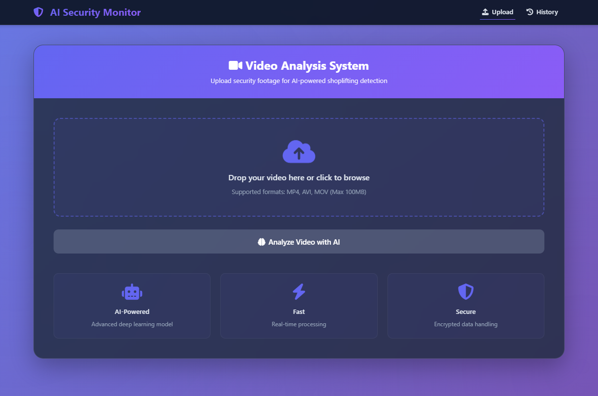
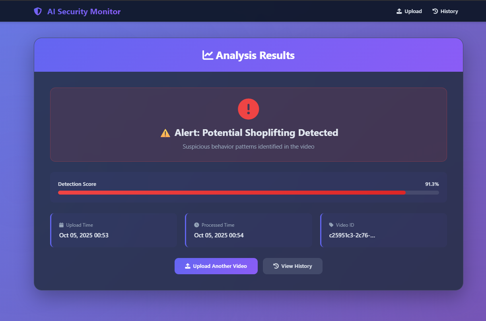
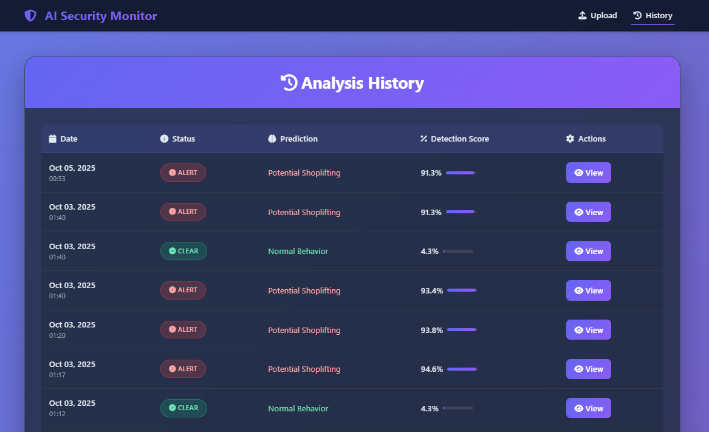

# AI-Powered Shoplifting Detection System

An intelligent video analysis system that uses deep learning to detect potential shoplifting behavior in retail surveillance footage. This project combines computer vision and temporal modeling to identify suspicious activities in real-time.



## Table of Contents

- [Overview](#overview)
- [Features](#features)
- [System Architecture](#system-architecture)
- [Dataset Preparation](#dataset-preparation)
- [Model Training](#model-training)
- [Web Application](#web-application)
- [Installation](#installation)
- [Usage](#usage)
- [Technologies Used](#technologies-used)


## Overview

This project addresses the growing challenge of retail theft through automated video surveillance analysis. By leveraging deep learning techniques, the system can analyze security footage and flag potentially suspicious behavior patterns associated with shoplifting.

### Key Highlights

- **Two Training Approaches**: Transfer learning with pre-trained models (LSTM) and training from scratch (Conv3D)
- **Real-time Analysis**: Process videos and receive instant predictions
- **Professional Web Interface**: Django-based application with modern UI
- **High Accuracy**: Trained on diverse shoplifting scenarios with robust data preprocessing
- **Production Ready**: Complete deployment pipeline with model serving

## Features

### Core Functionality

- **Video Upload & Analysis**: Drag-and-drop interface for easy video submission
- **Dual Model Architecture**: 
  - LSTM-based model with MobileNetV2 feature extraction
  - Conv3D model trained from scratch
- **Confidence Scoring**: Detailed confidence metrics for each prediction
- **Historical Analysis**: Track and review all analyzed videos
- **Real-time Processing**: Background processing with status updates

### Data Quality Assurance

- **Duplicate Detection**: Automatic identification and removal of duplicate videos using perceptual hashing
- **Data Validation**: Ensures dataset integrity before training
- **Frame Sampling**: Intelligent frame extraction for optimal model performance

## System Architecture


## Dataset Preparation

### Directory Structure

```
dataset/
├── shoplifters/          # Videos with shoplifting behavior
└── non-shoplifters/      # Normal customer behavior videos
```

### Data Preprocessing - The Crucial Step

The `duplicate_videos_check.py` script is **essential** for maintaining dataset quality and preventing data leakage:

```python
# Remove duplicate videos to prevent overfitting and data leakage
python duplicate_videos_check.py
```

**What it does:**
- Uses **perceptual hashing (pHash)** to compute unique fingerprints for each video
- Identifies visually similar or duplicate videos across the dataset
- Automatically detects and removes duplicates to ensure model generalization
- Prevents data leakage between training and validation sets
- Maintains dataset integrity by keeping only unique video samples

**Why it's critical:**
- Duplicate videos can cause the model to memorize specific examples rather than learn general patterns
- Ensures the validation set truly represents unseen data
- Improves model generalization to real-world scenarios
- Prevents inflated accuracy metrics from duplicate content

**Run this before every training session** to ensure your dataset is clean and your model learns meaningful patterns.


## Model Training

### Option 1: Transfer Learning with LSTM (Recommended)

**File**: `shop-lifter-pre.ipynb`

Uses a pre-trained MobileNetV2 backbone for feature extraction combined with LSTM layers for temporal modeling.

**Architecture:**
```
MobileNetV2 (Pre-trained) → GlobalAveragePooling2D → LSTM(128) → LSTM(64) → Dense(64) → Output
```

**Advantages:**
- Faster training convergence
- Better performance with limited data
- Leverages ImageNet pre-trained weights
- Lower computational requirements

**Training Configuration:**
```python
IMG_SIZE = (128, 128)
NUM_FRAMES = 16
BATCH_SIZE = 4
EPOCHS = 5

Metrics: Accuracy, Precision, Recall, F1-Score, AUC
```

### Option 2: Conv3D from Scratch

**File**: `shop_lifter.ipynb`

Trains a 3D Convolutional Neural Network from the ground up, learning both spatial and temporal features directly from video data.

**Architecture:**
```
Conv3D → MaxPooling3D → Conv3D → MaxPooling3D → Flatten → Dense → Output
```

**Advantages:**
- Learns task-specific features
- Better for domain-specific patterns
- Full control over architecture
- No dependency on pre-trained weights

**When to use:**
- Large dataset available (>10,000 videos)
- Specific shoplifting patterns not in ImageNet
- Computational resources available
- Custom feature learning required

## Web Application

### Django Application Structure

```
my_app/
├── video_classifier/
│   ├── models.py          # Database models
│   ├── views.py           # Request handlers
│   ├── services.py        # Model inference logic
│   ├── forms.py           # Upload forms
│   └── urls.py            # URL routing
├── templates/
│   └── video_classifier/
│       ├── base.html      # Base template
│       ├── upload.html    # Upload interface
│       ├── result.html    # Results display
│       └── list.html      # History page
├── models_storage/
│   └── model.keras        # Trained model
└── manage.py
```

### Features

1. **Modern UI/UX**
   - Gradient backgrounds with glassmorphism effects
   - Drag-and-drop file upload
   - Real-time processing indicators
   - Responsive design for all devices

2. **Video Processing**
   - Background thread processing
   - Status polling for live updates
   - Error handling and logging
   - Support for MP4, AVI, MOV formats

3. **Results Dashboard**
   - Confidence visualization
   - Historical analysis tracking
   - Detailed metadata display
   - Export capabilities



## Installation

### Prerequisites

- Python 3.8+
- TensorFlow 2.13.0
- Django 4.2+
- OpenCV
- CUDA (optional, for GPU acceleration)

### Step 1: Clone Repository

```bash
git clone https://github.com/gamal1osama/shop-lifting.git
cd shop-lifting
```

### Step 2: Create Virtual Environment

```bash
python -m venv venv

# Windows
venv\Scripts\activate

# Linux/Mac
source venv/bin/activate
```

### Step 3: Install Dependencies

```bash
pip install -r requirements.txt
```

### Step 4: Prepare Dataset

```bash
# Place your videos in the correct structure
dataset/
├── shoplifters/
└── non-shoplifters/

# IMPORTANT: Run duplicate detection before training
python duplicate_videos_check.py
```

### Step 5: Train Model

```bash
# Option 1: Transfer Learning (Recommended)
jupyter notebook shop-lifter-pre.ipynb

# Option 2: Conv3D from Scratch
jupyter notebook shop_lifter.ipynb
```

### Step 6: Setup Django Application

```bash
cd my_app

# Create database
python manage.py makemigrations
python manage.py migrate

# Copy trained model
# Place best_model.keras in models_storage/

# Run server
python manage.py runserver
```

### Step 7: Access Application

Open your browser and navigate to:
```
http://127.0.0.1:8000
```

## Usage

### Training a New Model

```python
# 1. CRITICAL: Run duplicate detection first
python duplicate_videos_check.py

# 2. Open training notebook
jupyter notebook shop-lifter-pre.ipynb

# 3. Run all cells
# Model will be saved as best_model.keras

# 4. Move model to Django app
cp best_model.keras my_app/models_storage/
```

### Using the Web Application

1. **Upload Video**
   - Navigate to the upload page
   - Drag and drop your video or click to browse
   - Supported formats: MP4, AVI, MOV
   - Maximum size: 100MB

2. **View Results**
   - System processes video in background
   - Real-time status updates
   - View confidence score and prediction
   - Access detailed analysis

3. **Review History**
   - View all previously analyzed videos
   - Filter by date and prediction
   - Export results for reporting



### Testing the Model

```bash
# Test model loading
python manage.py test_model

# Upload a test video through the web interface
# Check results and confidence scores
```

## Technologies Used

### Machine Learning

- **TensorFlow/Keras**: Deep learning framework
- **OpenCV**: Video processing
- **NumPy**: Numerical computations
- **Scikit-learn**: Model evaluation
- **MobileNetV2**: Pre-trained feature extractor

### Web Application

- **Django**: Web framework
- **Bootstrap 5**: UI components
- **Font Awesome**: Icons
- **JavaScript**: Interactive features
- **SQLite**: Database

### Development Tools

- **Jupyter Notebook**: Model development
- **Git**: Version control
- **VS Code**: Code editor

## Configuration

### Model Hyperparameters

```python
# Video Processing
IMG_SIZE = (128, 128)
NUM_FRAMES = 16
CHANNELS = 3

# Training
BATCH_SIZE = 4
EPOCHS = 5
LEARNING_RATE = 1e-5

# Data Split
TRAIN_SPLIT = 0.8
VAL_SPLIT = 0.2
RANDOM_SEED = 42
```

### Django Settings

```python
# File Upload
FILE_UPLOAD_MAX_MEMORY_SIZE = 100 * 1024 * 1024  # 100MB
ALLOWED_VIDEO_FORMATS = ['mp4', 'avi', 'mov']

# Model Path
MODEL_PATH = 'models_storage/model.keras'
```

## Important Notes

### Data Privacy

- This system is designed for legitimate security purposes only
- Ensure compliance with local privacy laws and regulations
- Obtain proper consent before deploying in production
- Store and handle video data securely

### Model Limitations

- Performance depends on video quality and lighting
- May require retraining for different retail environments
- False positives can occur with unusual but legitimate behavior
- Should be used as an assistance tool, not sole decision maker

### Best Practices

1. **Always run duplicate detection** before training (`duplicate_videos_check.py`)
2. **Balance your dataset** between classes
3. **Use validation set** to prevent overfitting
4. **Test on diverse scenarios** before deployment
5. **Monitor model performance** in production
6. **Regularly retrain** with new data

